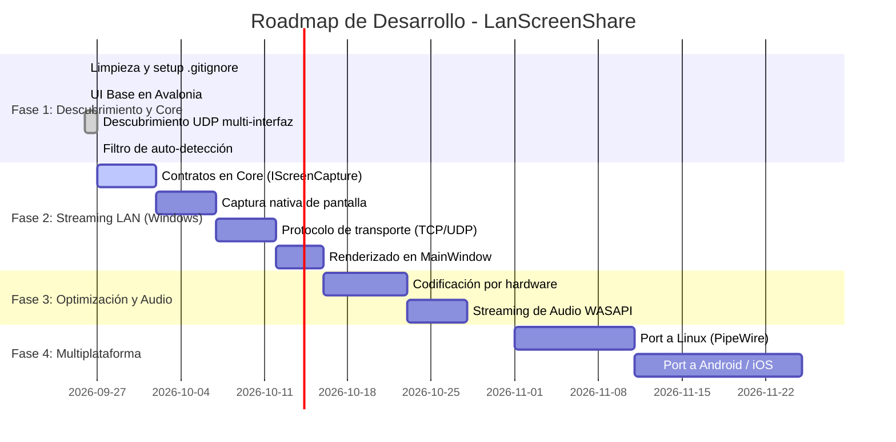

# LanScreenShare - Arquitectura, Roadmap y Diagrama de Clases

Documento de seguimiento técnico y evolución del proyecto. Este archivo debe actualizarse conforme se implementen nuevas características o se modifiquen contratos de arquitectura.

---

## 1. Visión y Objetivos del Proyecto

* **Objetivo principal:** Aplicación ligera y de alto rendimiento para compartir y visualizar pantalla en tiempo real a través de redes locales (LAN) con latencia mínima.
* **Estrategia nativa:** En Windows, aprovechar las APIs nativas del sistema (`Windows.Graphics.Capture`, DXGI, Media Foundation) sin exigir a los usuarios herramientas externas pesadas (como OBS o ejecutables ffmpeg independientes).
* **Diseño orientado a Multiplataforma:** 
  * Interfaz construida sobre **Avalonia UI**, lo que permite compilar la misma UI en **Windows, Linux, macOS, Android e iOS**.
  * Arquitectura desacoplada en la capa multimedia: contratos comunes en `LanScreenShare.Core` e implementaciones de captura/renderizado específicas por sistema operativo en `LanScreenShare.Media`.

---

## 2. Tecnologías y Herramientas Utilizadas

| Componente | Tecnología | Justificación |
| :--- | :--- | :--- |
| **Plataforma base** | .NET 9.0 (C#) | Alto rendimiento, manejo eficiente de memoria asincrónica (`Span<T>`, `Memory<T>`). |
| **Interfaz de Usuario** | Avalonia UI 12.0.2 | Framework XAML multiplataforma nativo compatible con escritorio y móviles. |
| **Descubrimiento LAN** | Sockets UDP (`System.Net.Sockets`) | Broadcast dirigido por subred física (ej. `192.168.100.255`) para rápida detección entre pares. |
| **Control de versiones** | Git + `.gitignore` completo | Repositorio limpio sin artefactos binarios (`bin/`, `obj/`, `.vs/`). |
| **Captura en Windows (Objetivo)** | `Windows.Graphics.Capture` / DXGI | Captura acelerada por GPU integrada en Windows 10/11 sin latencia de CPU. |
| **Captura en Linux (Futuro)** | PipeWire / X11 XComposite | Estándar moderno de captura de escritorio en entornos Linux. |
| **Captura en Android (Futuro)** | `MediaProjection API` | API nativa de Android para transmisión de pantalla. |

---

## 3. Estado de Hitos

### ✅ Hitos Completados (Fase 1)
- [x] **Configuración del Repositorio:** Creación de `.gitignore` exhaustivo y purga del índice remoto de carpetas `bin/`, `obj/` y `.vs/`.
- [x] **Modelos Base:** Creación del modelo `DeviceInfo` para representar pares en la red.
- [x] **Servicio de Descubrimiento UDP:**
  - Envío periódico a través de broadcast dirigido por subred (`Subnet Directed Broadcast`) en lugar de depender únicamente de `255.255.255.255`.
  - Soporte multi-interfaz (aislando interfaces virtuales de VMware, VPNs y Loopback).
  - Manejo de exclusión mutua para evitar auto-descubrimiento en la misma máquina (`IsSelfMessage`).
- [x] **UI Inicial:** Ventana con panel lateral de acciones (*"Host Stream"*, *"Buscar dispositivos"*), lista reactiva de pares encontrados y área central para video.

---

### ⏳ Siguientes Pasos Inmediatos (Fase 2: Streaming LAN)

1. **Definir Contratos en `LanScreenShare.Core`:**
   - `IScreenCaptureService`: Abstracción para iniciar, pausar y detener la captura de fotogramas, desacoplando la lógica de la plataforma.
   - `CapturedFrame`: Estructura para transferir el búfer de píxeles, resolución y formato.
   - `IStreamServer` / `IStreamClient`: Contratos para el transporte de video en red.

2. **Implementar Captura Nativa en `LanScreenShare.Media` (Windows):**
   - Implementar `WindowsCaptureService` usando `Windows.Graphics.Capture` o `DXGI Desktop Duplication`.
   - Conversión eficiente de fotogramas a memoria compartida o compresión preliminar.

3. **Protocolo de Streaming en `LanScreenShare.Network`:**
   - Establecer conexión directa entre cliente y host al hacer clic en un dispositivo de la lista.
   - Implementar un canal de streaming por TCP o UDP optimizado para transportar los cuadros con encabezados de longitud y timestamp.

4. **Renderizado en `LanScreenShare.Desktop`:**
   - Recibir el flujo de bytes en el cliente y volcarlo en un `WriteableBitmap` en Avalonia para visualizar la pantalla remota en tiempo real.

---

## 4. Diagrama de Clases y Arquitectura

El siguiente diagrama refleja la estructura actual y los contratos previstos para garantizar portabilidad a Linux y Móviles:

```mermaid
classDiagram
    %% Capa Core
    namespace LanScreenShare_Core {
        class DeviceInfo {
            +string Name
            +string IPAddress
            +DateTime LastSeen
        }

        class CapturedFrame {
            +byte[] Data
            +int Width
            +int Height
            +long Timestamp
        }

        class IScreenCaptureService {
            <<interface>>
            +StartCapture() void
            +StopCapture() void
            +event OnFrameArrived
        }

        class IStreamTransport {
            <<interface>>
            +StartStreaming(string targetIp, int port) Task
            +StopStreaming() void
            +event OnFrameReceived
        }
    }

    %% Capa Red
    namespace LanScreenShare_Network {
        class DiscoveryService {
            -int DiscoveryPort
            -string BroadcastMessagePrefix
            -CancellationTokenSource _hostCts
            -CancellationTokenSource _listenCts
            +StartHostingBroadcast() void
            +StopHosting() void
            +StartListening() void
            +StopListening() void
            -GetActiveBroadcastTargets() List
            -CalculateBroadcastAddress(IPAddress, IPAddress) IPAddress
            -IsSelfMessage(string, string, string) bool
            +event OnDeviceDiscovered
        }

        class TcpStreamServer {
            -TcpListener _listener
            +Start(int port) Task
            +BroadcastFrame(CapturedFrame frame) Task
            +Stop() void
        }

        class TcpStreamClient {
            -TcpClient _client
            +Connect(string hostIp, int port) Task
            +event OnFrameReceived
            +Disconnect() void
        }
    }

    %% Capa Media (Específica por SO)
    namespace LanScreenShare_Media {
        class WindowsCaptureService {
            -bool _isCapturing
            +StartCapture() void
            +StopCapture() void
            -ProcessDxgiFrame() void
        }

        class LinuxPipeWireCaptureService {
            <<futuro>>
            +StartCapture() void
            +StopCapture() void
        }

        class AndroidMediaProjectionCaptureService {
            <<futuro>>
            +StartCapture() void
            +StopCapture() void
        }
    }

    %% Capa UI (Avalonia)
    namespace LanScreenShare_Desktop {
        class MainWindow {
            -DiscoveryService _discoveryService
            +ObservableCollection~DeviceInfo~ Devices
            -HostButton_Click(object, RoutedEventArgs) void
            -SearchButton_Click(object, RoutedEventArgs) void
            -DiscoveryService_OnDeviceDiscovered(object, DeviceInfo) void
            -DeviceList_SelectionChanged(object, SelectionChangedEventArgs) void
        }

        class App {
            +Initialize() void
            +OnFrameworkInitializationCompleted() void
        }

        class Program {
            +Main(string[] args)$ void
            +BuildAvaloniaApp()$ AppBuilder
        }
    }

    %% Relaciones e Implementaciones
    DiscoveryService ..> DeviceInfo : emite / descubre
    MainWindow --> DiscoveryService : utiliza
    MainWindow --> DeviceInfo : muestra lista
    MainWindow ..> IStreamTransport : inicia conexion

    IScreenCaptureService <|.. WindowsCaptureService : implementa en Windows
    IScreenCaptureService <|.. LinuxPipeWireCaptureService : implementa en Linux
    IScreenCaptureService <|.. AndroidMediaProjectionCaptureService : implementa en Android

    IStreamTransport <|.. TcpStreamServer : implementa emisor
    IStreamTransport <|.. TcpStreamClient : implementa receptor

    WindowsCaptureService ..> CapturedFrame : produce
    TcpStreamServer ..> CapturedFrame : envía
    TcpStreamClient ..> CapturedFrame : recibe
```

---

## 5. Consideraciones para Móviles y Linux

1. **Aislamiento de Plataforma:**
   - Ningún proyecto debe tener referencias a APIs de Windows excepto `LanScreenShare.Media` (mediante directivas `#if WINDOWS` o proyectos satélite como `LanScreenShare.Media.Windows`, `LanScreenShare.Media.Linux`, `LanScreenShare.Media.Android`).
   - `LanScreenShare.Core`, `LanScreenShare.Network` y `LanScreenShare.Desktop` se mantienen 100% agnósticos del sistema operativo.
2. **Avalonia en Android / iOS:**
   - La arquitectura de vistas (`Views` / `UserControls`) debe separarse de las ventanas (`Window`), ya que en móviles se utiliza `SingleViewApplicationLifetime` en lugar de `ClassicDesktopStyleApplicationLifetime`.
3. **Manejo de Red en Móviles:**
   - En Android, los sockets UDP de broadcast requieren solicitar explícitamente el bloqueo de multicast (`WifiManager.MulticastLock`). Esto se incorporará en el ciclo de vida del adaptador móvil.
