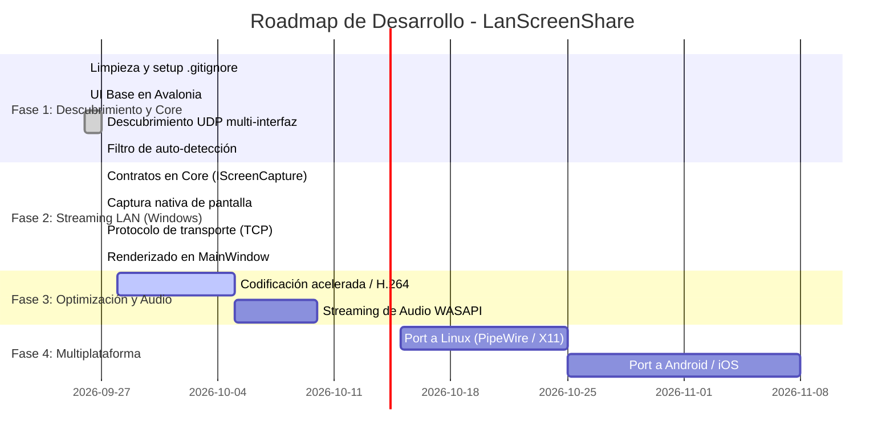

# LanScreenShare - Arquitectura, Roadmap y Diagrama de Clases

Documento de seguimiento técnico y evolución del proyecto. Este archivo debe actualizarse conforme se implementen nuevas características o se modifiquen contratos de arquitectura.

---

## 1. Visión y Objetivos del Proyecto

* **Objetivo principal:** Aplicación ligera y de alto rendimiento para compartir y visualizar pantalla en tiempo real a través de redes locales (LAN) con latencia mínima.
* **Estrategia nativa:** En Windows, aprovechar las APIs nativas del sistema (`Windows.Graphics.Capture`, DXGI, Media Foundation) sin exigir a los usuarios herramientas externas pesadas (como OBS o ejecutables ffmpeg independientes).
* **Diseño orientado a Multiplataforma:** 
  * Interfaz construida sobre **Avalonia UI**, lo que permite compilar la misma UI en **Windows, Linux, macOS, Android e iOS**.
  * Arquitectura desacoplada en la capa multimedia: contratos comunes en `LanScreenShare.Core` e implementaciones de captura/renderizado específicas por sistema operativo en `LanScreenShare.Media`.

---

## 2. Tecnologías y Herramientas Utilizadas

| Componente | Tecnología | Justificación |
| :--- | :--- | :--- |
| **Plataforma base** | .NET 9.0 (C#) | Alto rendimiento, manejo eficiente de memoria asincrónica (`Span<T>`, `Memory<T>`). |
| **Interfaz de Usuario** | Avalonia UI 12.0.2 | Framework XAML multiplataforma nativo compatible con escritorio y móviles. |
| **Descubrimiento LAN** | Sockets UDP (`System.Net.Sockets`) | Broadcast dirigido por subred física (ej. `192.168.100.255`) para rápida detección entre pares. |
| **Control de versiones** | Git + `.gitignore` completo | Repositorio limpio sin artefactos binarios (`bin/`, `obj/`, `.vs/`). |
| **Captura en Windows (Objetivo)** | `Windows.Graphics.Capture` / DXGI | Captura acelerada por GPU integrada en Windows 10/11 sin latencia de CPU. |
| **Captura en Linux (Futuro)** | PipeWire / X11 XComposite | Estándar moderno de captura de escritorio en entornos Linux. |
| **Captura en Android (Futuro)** | `MediaProjection API` | API nativa de Android para transmisión de pantalla. |

---

## 3. Estado de Hitos

### ✅ Hitos Completados (Fases 1 y 2)
- [x] **Configuración del Repositorio:** Creación de `.gitignore` exhaustivo y purga del índice remoto de carpetas `bin/`, `obj/` y `.vs/`.
- [x] **Modelos Base:** Creación del modelo `DeviceInfo` y `CapturedFrame`.
- [x] **Servicio de Descubrimiento UDP:**
  - Envío periódico a través de broadcast dirigido por subred (`Subnet Directed Broadcast`).
  - Soporte multi-interfaz (aislando interfaces virtuales de VMware, VPNs y Loopback).
  - Manejo de exclusión mutua para evitar auto-descubrimiento en la misma máquina (`IsSelfMessage`).
- [x] **Contratos de Streaming en `LanScreenShare.Core`:**
  - `IScreenCaptureService` (captura agnóstica de plataforma).
  - `IStreamServer` (servidor de emisión de cuadros).
  - `IStreamClient` (receptor y cliente de cuadros).
  - `CapturedFrame` (búfer de imagen, dimensiones, timestamp y formato).
- [x] **Captura de Pantalla Nativa en `LanScreenShare.Media` (Windows):**
  - Implementación en `WindowsScreenCaptureService` utilizando Win32 GDI Desktop Capture (`BitBlt` con soporte de cursor y ventanas transparentes).
  - Compresión de fotogramas ultrarrápida a JPEG mediante SkiaSharp.
- [x] **Protocolo de Streaming en `LanScreenShare.Network`:**
  - `TcpStreamServer`: Servidor TCP con encabezado estructurado de 24 bytes (Magic `LSS1`, longitud, resolución, timestamp).
  - `TcpStreamClient`: Cliente TCP con deserialización de cuadros y reconexión limpia.
- [x] **Renderizado en Tiempo Real en `LanScreenShare.Desktop`:**
  - Integración en `MainWindow.axaml` con control `Image` y decodificación asincrónica en Avalonia `Bitmap`.
  - Estados de conexión (transmitiendo, viendo pantalla de par, desconectado, indicador LED de estado).

---

### ⏳ Siguientes Pasos (Fase 3: Optimización y Audio)

1. **Ajuste dinámico de calidad y FPS:**
   - Permitir ajustar calidad JPEG (50% a 90%) o resolución para adaptarse al ancho de banda de la red Wi-Fi.
2. **Streaming de Audio del Sistema (Windows WASAPI Loopback):**
   - Capturar el audio de reproducción del sistema en Windows usando WASAPI (`AudioClient.Initialize` en modo Loopback) y transmitirlo multiplexado o en canal paralelo.
3. **Control Remoto (Opcional):**
   - Transmisión de eventos de mouse y teclado desde el cliente hacia el host para soporte/control interactivo.

---

## 4. Diagrama de Clases y Arquitectura

El siguiente diagrama refleja la estructura implementada:

```mermaid
classDiagram
    %% Capa Core
    namespace LanScreenShare_Core {
        class DeviceInfo {
            +string Name
            +string IPAddress
            +DateTime LastSeen
        }

        class CapturedFrame {
            +byte[] Data
            +int Width
            +int Height
            +long Timestamp
            +string Format
        }

        class IScreenCaptureService {
            <<interface>>
            +bool IsCapturing
            +StartCapture(int targetFps, int quality) void
            +StopCapture() void
            +event FrameCaptured
        }

        class IStreamServer {
            <<interface>>
            +bool IsRunning
            +int ConnectedClientsCount
            +StartAsync(int port, CancellationToken) Task
            +BroadcastFrameAsync(CapturedFrame) Task
            +Stop() void
            +event ClientConnected
            +event ClientDisconnected
        }

        class IStreamClient {
            <<interface>>
            +bool IsConnected
            +ConnectAsync(string hostIp, int port, CancellationToken) Task
            +DisconnectAsync() Task
            +event FrameReceived
            +event StatusChanged
        }
    }

    %% Capa Red
    namespace LanScreenShare_Network {
        class DiscoveryService {
            -int DiscoveryPort
            -string BroadcastMessagePrefix
            +StartHostingBroadcast() void
            +StopHosting() void
            +StartListening() void
            +StopListening() void
            +event OnDeviceDiscovered
        }

        class TcpStreamServer {
            -TcpListener _listener
            -ConcurrentDictionary _clients
            +StartAsync(int port, CancellationToken) Task
            +BroadcastFrameAsync(CapturedFrame frame) Task
            +Stop() void
        }

        class TcpStreamClient {
            -TcpClient _client
            +ConnectAsync(string hostIp, int port, CancellationToken) Task
            +DisconnectAsync() Task
            +event FrameReceived
        }
    }

    %% Capa Media (Específica por SO)
    namespace LanScreenShare_Media {
        class WindowsScreenCaptureService {
            -bool _isCapturing
            -CancellationTokenSource _cts
            +StartCapture(int targetFps, int quality) void
            +StopCapture() void
            -CaptureDesktopFrame(int quality) CapturedFrame
            -DrawMouseCursor(IntPtr, int, int)$ void
        }

        class LinuxPipeWireCaptureService {
            <<futuro>>
            +StartCapture(int, int) void
            +StopCapture() void
        }

        class AndroidMediaProjectionCaptureService {
            <<futuro>>
            +StartCapture(int, int) void
            +StopCapture() void
        }
    }

    %% Capa UI (Avalonia)
    namespace LanScreenShare_Desktop {
        class MainWindow {
            -DiscoveryService _discoveryService
            -IScreenCaptureService _screenCaptureService
            -IStreamServer _streamServer
            -IStreamClient _streamClient
            +ObservableCollection~DeviceInfo~ Devices
            -HostButton_Click(object, RoutedEventArgs) void
            -SearchButton_Click(object, RoutedEventArgs) void
            -ConnectDevice_Click(object, RoutedEventArgs) void
            -DisconnectButton_Click(object, RoutedEventArgs) void
            -StreamClient_FrameReceived(object, CapturedFrame) void
        }

        class App {
            +Initialize() void
            +OnFrameworkInitializationCompleted() void
        }

        class Program {
            +Main(string[] args)$ void
            +BuildAvaloniaApp()$ AppBuilder
        }
    }

    %% Relaciones e Implementaciones
    IScreenCaptureService <|.. WindowsScreenCaptureService : implementa Windows
    IScreenCaptureService <|.. LinuxPipeWireCaptureService : implementa Linux (futuro)
    IScreenCaptureService <|.. AndroidMediaProjectionCaptureService : implementa Android (futuro)

    IStreamServer <|.. TcpStreamServer : implementa emisor
    IStreamClient <|.. TcpStreamClient : implementa receptor

    MainWindow --> DiscoveryService : usa
    MainWindow --> IScreenCaptureService : usa
    MainWindow --> IStreamServer : emite frames
    MainWindow --> IStreamClient : recibe frames
    MainWindow ..> CapturedFrame : renderiza en Image

    WindowsScreenCaptureService ..> CapturedFrame : produce
    TcpStreamServer ..> CapturedFrame : transporta
    TcpStreamClient ..> CapturedFrame : recibe
```

---

## 5. Consideraciones para Móviles y Linux

1. **Aislamiento de Plataforma:**
   - Ningún proyecto debe tener referencias a APIs de Windows excepto `LanScreenShare.Media` (mediante directivas `#if WINDOWS` o proyectos satélite como `LanScreenShare.Media.Windows`, `LanScreenShare.Media.Linux`, `LanScreenShare.Media.Android`).
   - `LanScreenShare.Core`, `LanScreenShare.Network` y `LanScreenShare.Desktop` se mantienen 100% agnósticos del sistema operativo.
2. **Avalonia en Android / iOS:**
   - La arquitectura de vistas (`Views` / `UserControls`) debe separarse de las ventanas (`Window`), ya que en móviles se utiliza `SingleViewApplicationLifetime` en lugar de `ClassicDesktopStyleApplicationLifetime`.
3. **Manejo de Red en Móviles:**
   - En Android, los sockets UDP de broadcast requieren solicitar explícitamente el bloqueo de multicast (`WifiManager.MulticastLock`). Esto se incorporará en el ciclo de vida del adaptador móvil.
